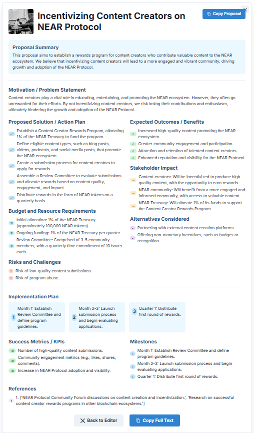

# NEAR Governance Proposal Generator



A powerful web application that helps community members create comprehensive governance proposals for the NEAR Protocol. Users provide a simple idea, and the AI-powered system generates a complete, structured proposal with all necessary sections, ready for submission to the NEAR governance process.

## 🌟 Features

- **AI-Powered Generation**: Transform a simple idea into a complete governance proposal
- **Interactive Editing**: Modify any section with a user-friendly interface
- **Feedback-Based Regeneration**: Provide feedback to regenerate specific sections or items
- **Section Management**: Lock/unlock sections as you complete them
- **Content Export**: Copy the full text or individual sections for external use
- **Responsive Design**: Works seamlessly on desktop and mobile devices

## 🚀 Live Demo

Try the application here: [NEAR Governance Proposal Generator](https://aluhning.github.io/governance-proposal/)

## 🛠️ Technology Stack

- **Frontend**: React 19 with TypeScript
- **Build Tool**: Vite for fast development and optimized builds
- **Package Manager**: PNPM for efficient dependency management
- **UI Framework**: Chakra UI for accessible and responsive components
- **State Management**: Zustand for lightweight state management
- **Forms**: React Hook Form for efficient form handling
- **API Integration**: Axios for API communication
- **AI Integration**: Langflow API for AI-powered content generation

## 🏁 Getting Started

### Prerequisites

- Node.js (v18 or higher)
- PNPM or NPM
- A Langflow API key (for AI content generation)

### Installation

1. Clone the repository
   ```bash
   git clone https://github.com/aluhning/governance_proposal_agent.git
   cd governance_proposal_agent/governance-app
   ```

2. Install dependencies
   ```bash
   pnpm install
   # or using npm
   npm install
   ```

3. Create a `.env` file in the project root and add your Langflow API key:
   ```
   VITE_LANGFLOW_API_KEY=your_api_key_here
   ```

4. Start the development server
   ```bash
   pnpm dev
   # or using npm
   npm run dev
   ```

5. Open your browser and visit `http://localhost:5173/` to see the application

## 💻 Development

### Available Scripts

- `pnpm dev` - Start the development server
- `pnpm build` - Build the application for production
- `pnpm preview` - Preview the production build locally
- `pnpm lint` - Run ESLint to check for code issues
- `pnpm deploy` - Deploy the application to GitHub Pages

### Project Structure

```
src/
├── components/        # UI components (ProposalForm, ProposalCard, FeedbackModal, etc.)
├── hooks/             # Custom React hooks (useProposal, etc.)
├── pages/             # Page components (HomePage)
├── services/          # API services (langflowService)
├── store/             # Zustand store for state management
├── types/             # TypeScript types and interfaces
└── utils/             # Utility functions for data manipulation
```

## 🖥️ User Interface

The application features an intuitive user interface:

1. **Input Form**: Enter your proposal idea and relevant details
2. **Generation**: AI generates a complete proposal with multiple sections
3. **Review & Edit**: Modify any section or regenerate content with feedback
4. **Export**: Copy your proposal for submission or further refinement

## 🚢 Deployment

### GitHub Pages Deployment

This project is configured for GitHub Pages deployment using GitHub Actions:

1. The workflow automatically builds and deploys changes to the `main` branch
2. Deployment configuration is in `.github/workflows/deploy.yml`

To manually deploy:

```bash
pnpm deploy
# or using npm
npm run deploy
```

### Custom Deployment

To deploy to your own hosting:

1. Build the application
   ```bash
   pnpm build
   ```

2. The build output in the `dist` directory can be deployed to any static hosting service
3. Make sure to configure your server for Single Page Application routing

## 🤝 Contributing

Contributions are welcome! Please feel free to submit a Pull Request.

1. Fork the repository
2. Create your feature branch (`git checkout -b feature/amazing-feature`)
3. Commit your changes (`git commit -m 'Add some amazing feature'`)
4. Push to the branch (`git push origin feature/amazing-feature`)
5. Open a Pull Request

## 📄 License

This project is licensed under the MIT License - see the LICENSE file for details.

## 🙏 Acknowledgements

- [NEAR Protocol](https://near.org/) for inspiring this project
- [Nearflow](https://ai.vitalpoint.ai/) for providing the AI backend
- All contributors who have helped improve this project
```
